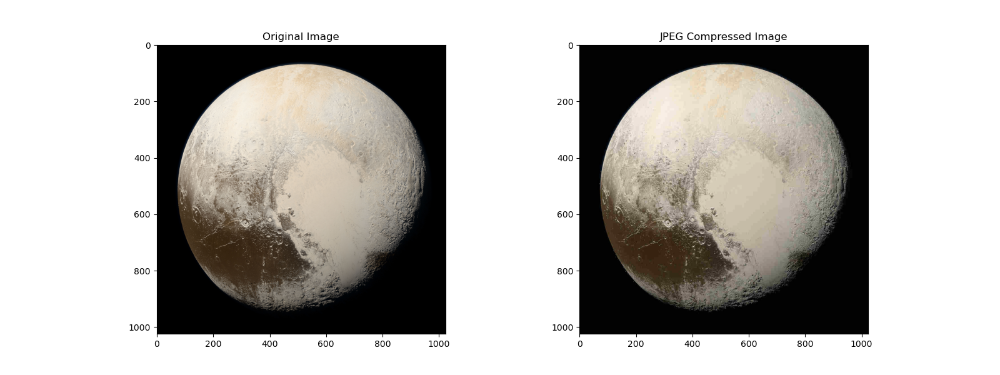
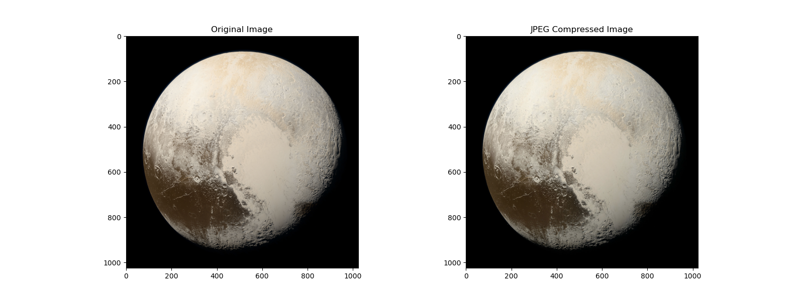
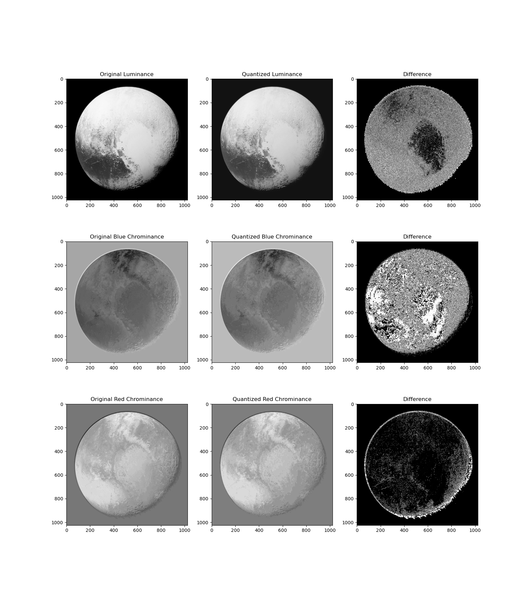
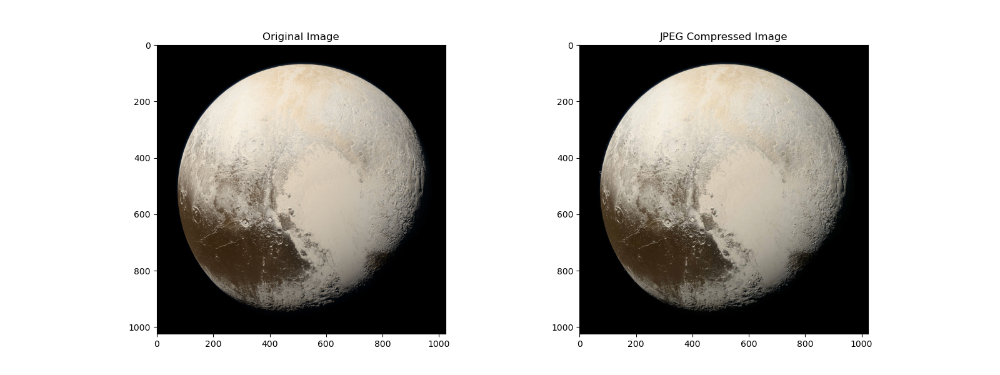
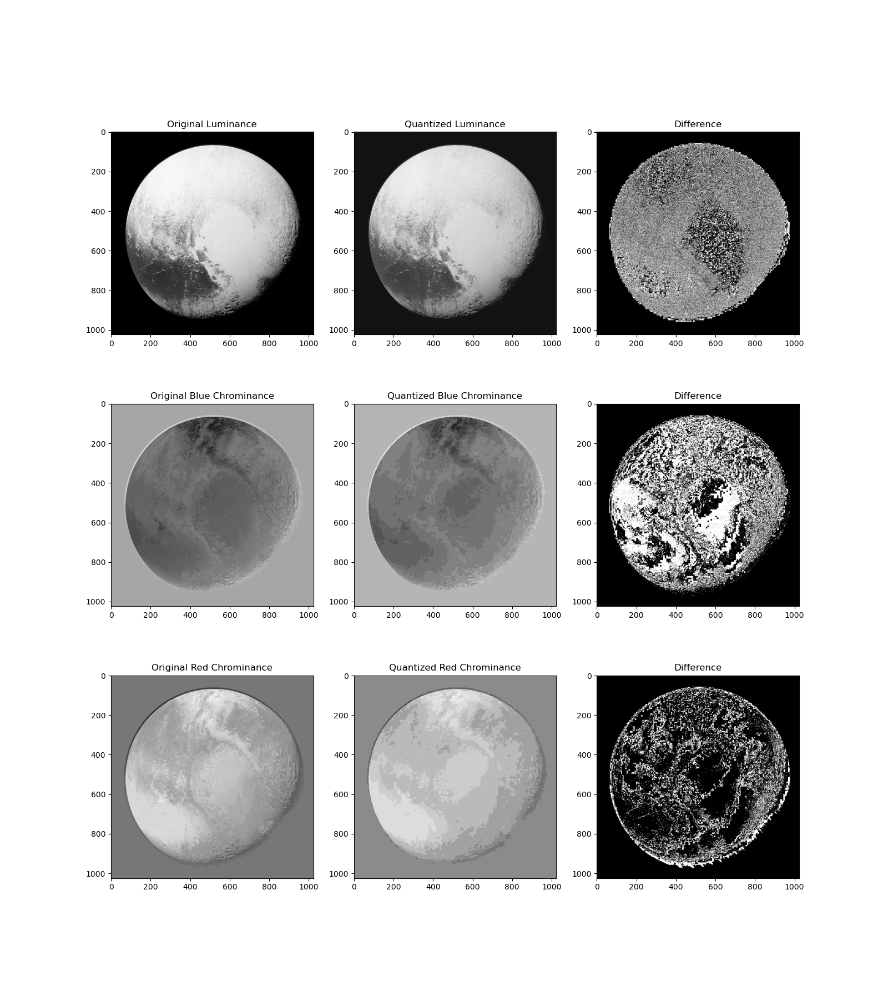
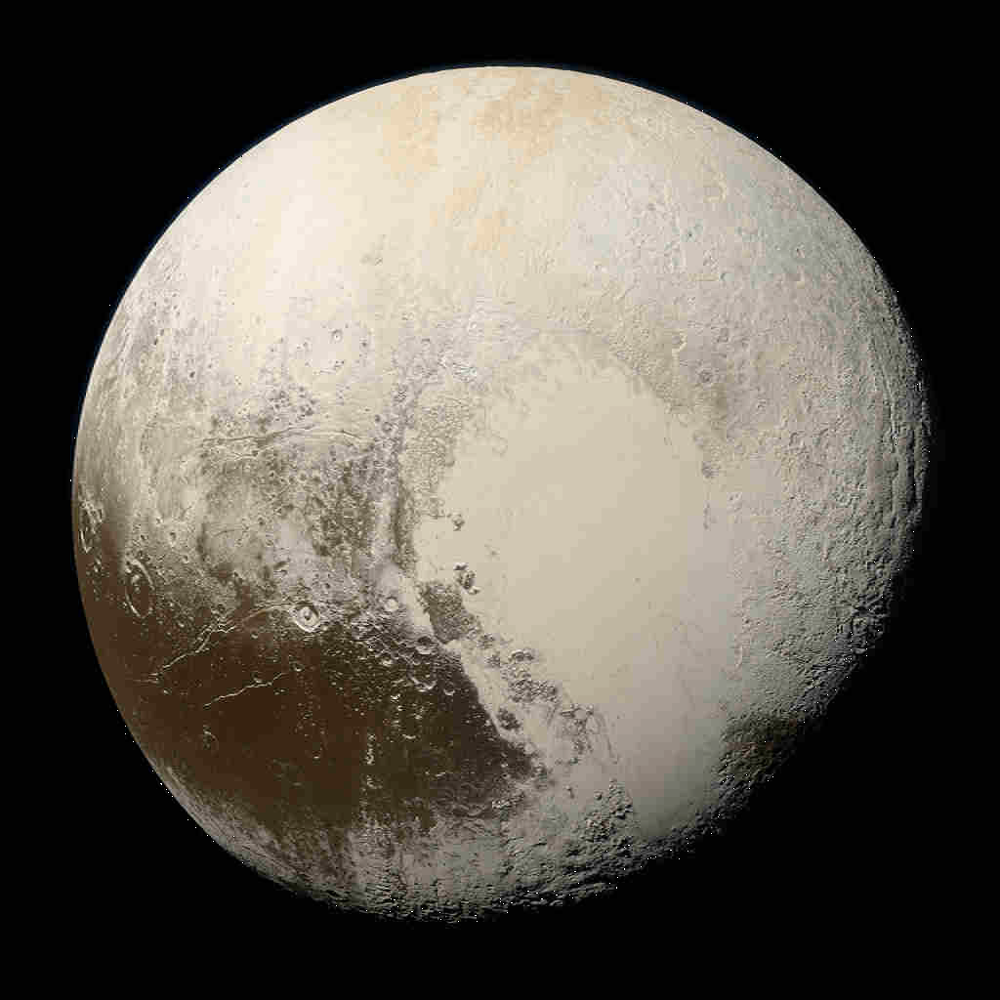
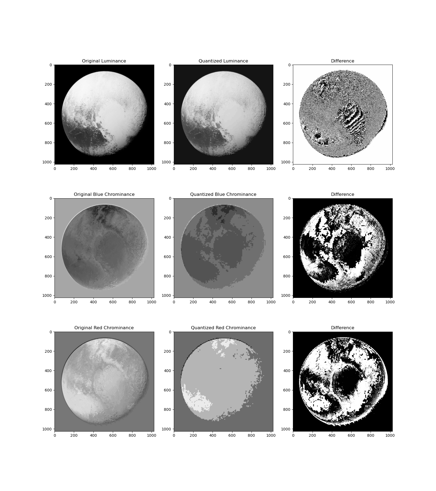
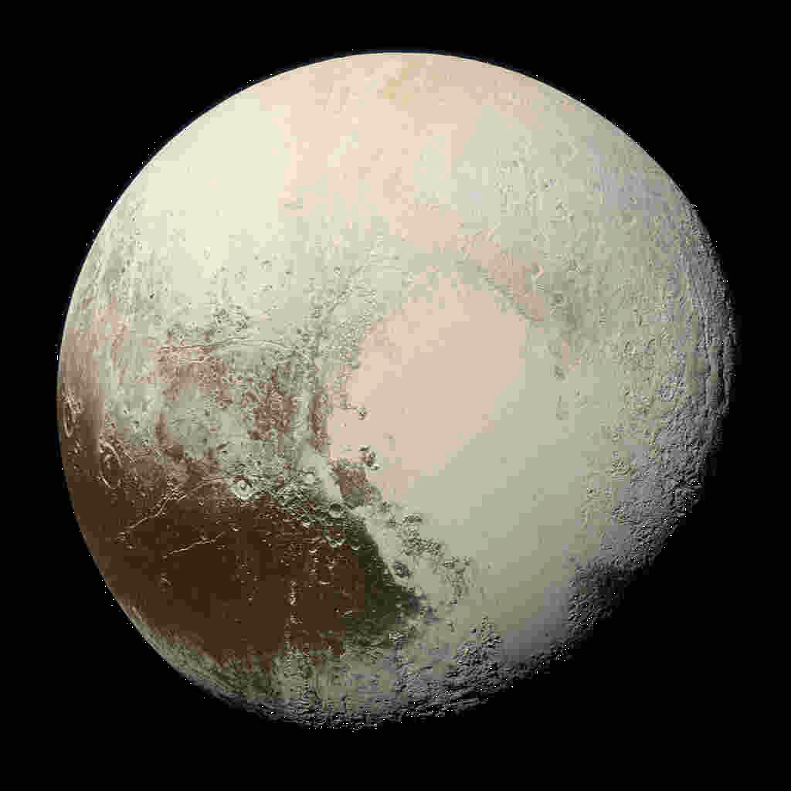
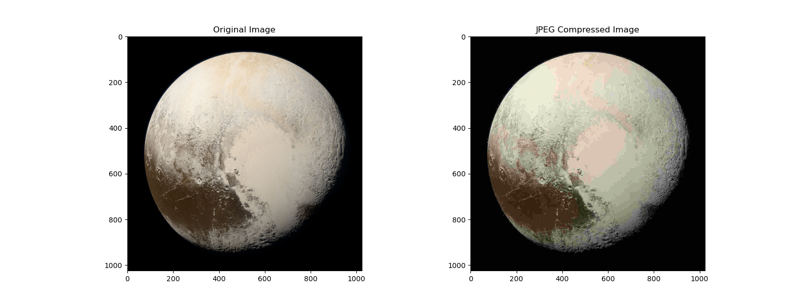
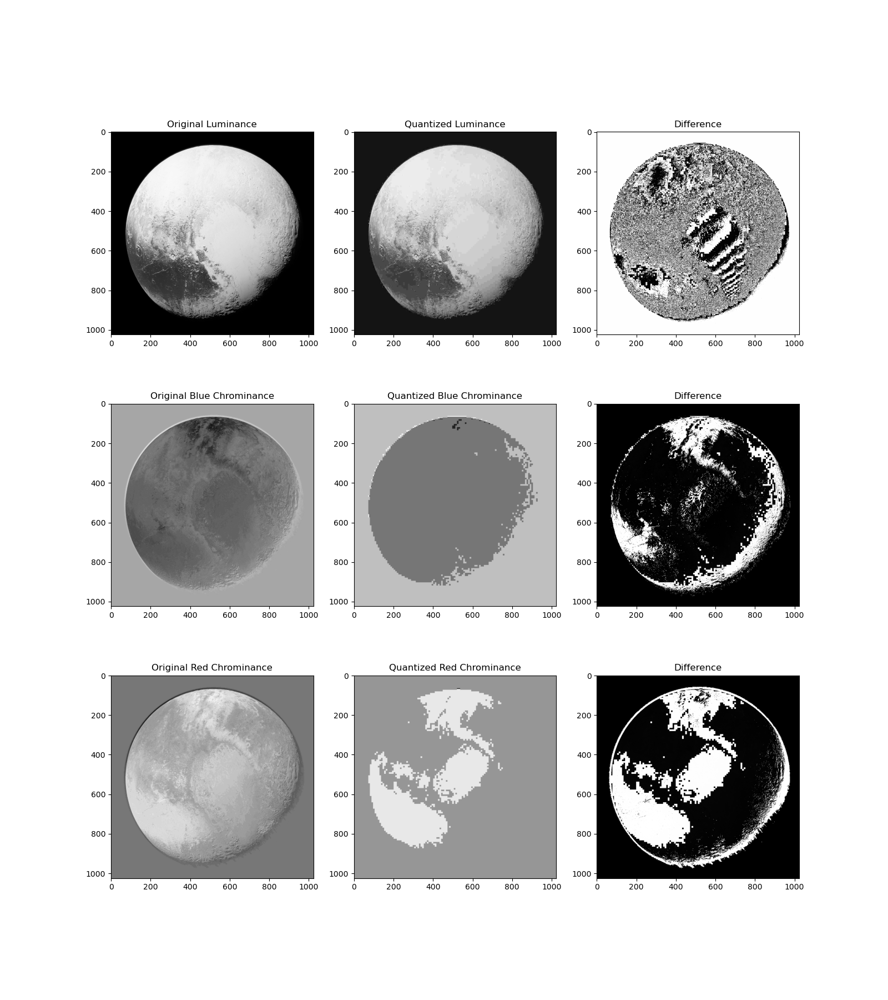

# JPEG Encoder

A JPEG encoder implemented in Python

The script does not generate usable `.jpg` files in truth,
but it will perform the transforms needed to convert e.g. a PNG
image to JPEG at a requested quality level, showing the difference
in each luma and chroma channel from the original source image
and the JPEG-ified output.

## Encoding Steps

1. Convert image RGB pixel values to the [YCbCr](https://en.wikipedia.org/wiki/YCbCr) (luma+chroma) color space.
2. Compute the [discrete cosine transform](https://en.wikipedia.org/wiki/Discrete_cosine_transform) to find coefficients for high and low frequency content in 8x8 pixel blocks.
3. Compute a quantization table using a specified quality value, then divide each coefficient by the corresponding entry in the table. Divisors increase in magnitude for higher frequency image content.
4. Round resulting quotients to the nearest integer. This typically rounds high frequency coefficients to zero. Multiply by the original divisor to get the quantized coefficients, many of which will now be zero.

## Decoding Steps

1. Perform an inverse discrete cosine transform to obtain quantized YCbCr pixel values.
2. Convert YCbCr color data to RGB to display the image.

## Compression

The strength of the JPEG encoding process lies in the quantization and removal of high frequency content.
High frequency content is less noticeable than low frequency content,
so it can be removed with little noticeable impact on many images
(notably [photographs](https://en.wikipedia.org/wiki/Joint_Photographic_Experts_Group)).
By employing [run-length encoding](https://en.wikipedia.org/wiki/Run-length_encoding) and traversing DCT coefficients from lowest frequency to highest, a long string of zeroes in the high frequency section may be represented compactly. Applying a further layer of [Huffman coding](https://en.wikipedia.org/wiki/Huffman_coding) can further compress the data.

# Results

## Quality = 90

## Quality = 50

## Quality = 20

## Quality = 10

